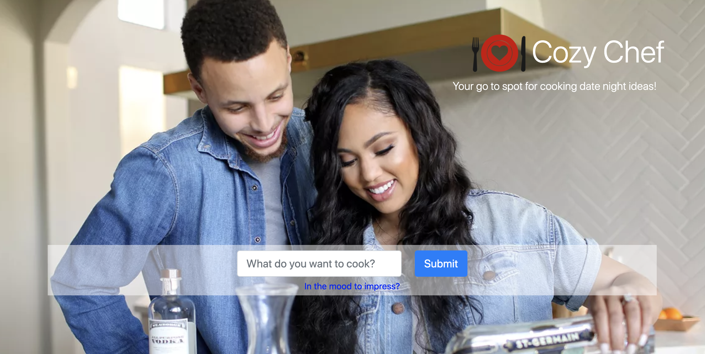

# Cozy Chef

Your go to spot for cooking date night ideas! Find the perfect recipe based on ingredients you have. And if a recipe isn't all you need, we've got conversation starters (by topic) too!

### How to Use

To search for recipes, enter an ingredient like "potato" or a dish such as "burgers". Hit enter or click the submit button and scroll down to view the top 10 recipes. Click on a image and you'll be taken to the recipe page.

To get a conversation starter, click on the text under the search bar that says "In the mood to impress?" From there, a pop-up will ask you to select a topic from the drop-down menu. Then hit enter or get opener button and a fun fact will be displayed.

## Built With

- [Bootstrap](https://getbootstrap.com/) - responsive framework for web
- Javascript
- Recipe Puppy API
- Open Trivia DB
- [Sweet Alert](https://sweetalert.js.org/) - makes pop up messages easy & pretty

## Versioning & Author

This is an modified version of [Project-1](https://github.com/llamadizzle/Project-1) and is maintained by me, [sabomade](https://github.com/sabomade).

## Acknowledgements

Built & completed as part of the UCB Coding Bootcamp, Group Project #1 with Riley Brenner, Jill Ralston, & Neil Hammerle
